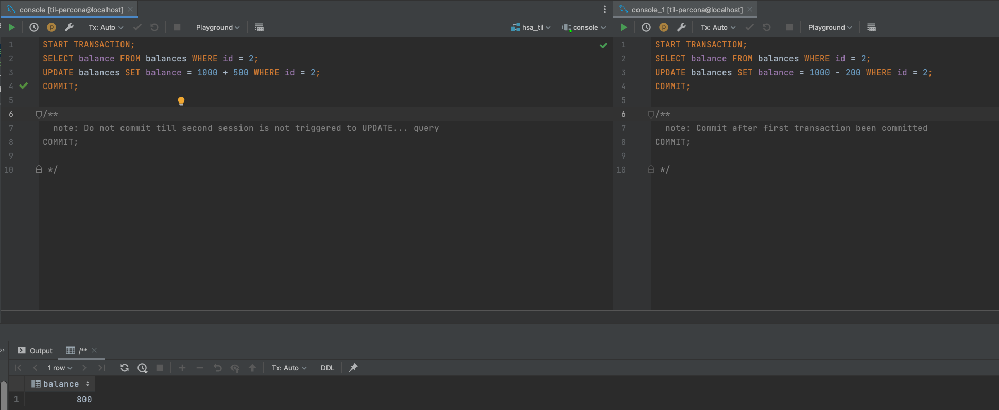
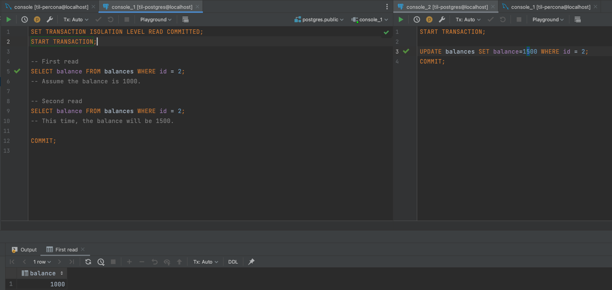

# hsa-transactions-isolations-locks

## How to start
1. Clone the repo to local machine
2. Run `docker-compose up -d`
3. Make connection to both created DBs via designated clients
4. Populate both DBs with start tables
   1. Postgres - `scripts/init/postgres/init.sql`
   2. Percona - `scripts/init/percona/init.sql`

## How to test
### Lost update
Run scripts named session_a/_b from `scripts/lost_update/...` 
1. Percona
   1. 
2. Postgres
   1. 

### Dirty read
Run scripts named session_a/_b from `scripts/dirty_read/...`
1. Percona
   1. 
   2. 
   3. 
2. Postgres
   1. 
   2. 
   3. 
   4. 
   5. Not reproducing in postgres due to its inner rule "READ UNCOMMITTED = READ COMMITTED"

### Non-repeatable read
Run scripts named session_a/_b from `scripts/non_repeatable_read/...`
1. Percona
   1. 
   2. 
   3. 
2. Postgres
   1. 
   2. 
   3. 

### Phantom read
Run scripts named session_a/_b from `scripts/phantom_read/...`
1. Percona
   1. 
   2. 
   3. 
2. Postgres
   1. 
   2. 
   3. 